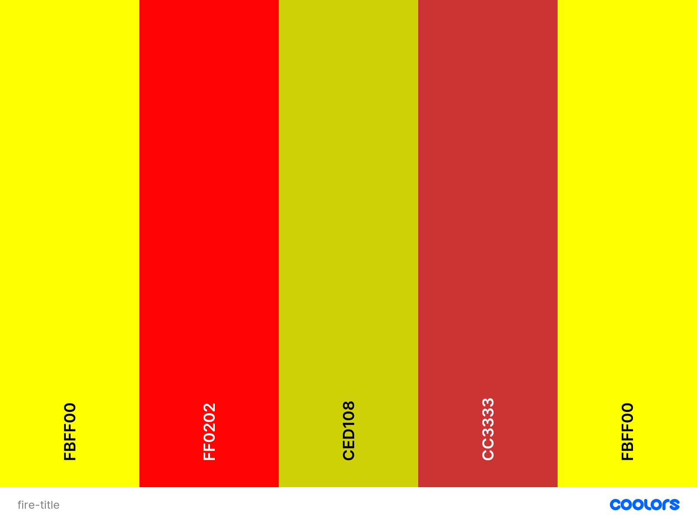
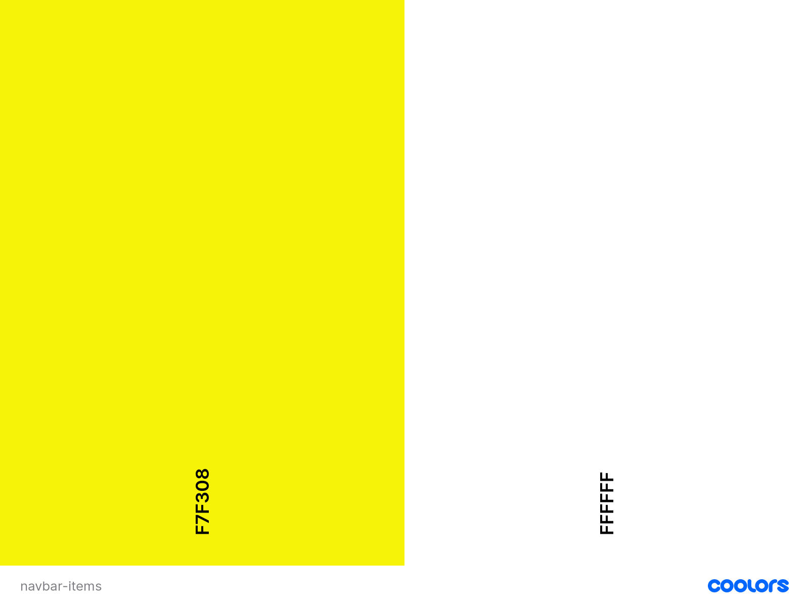
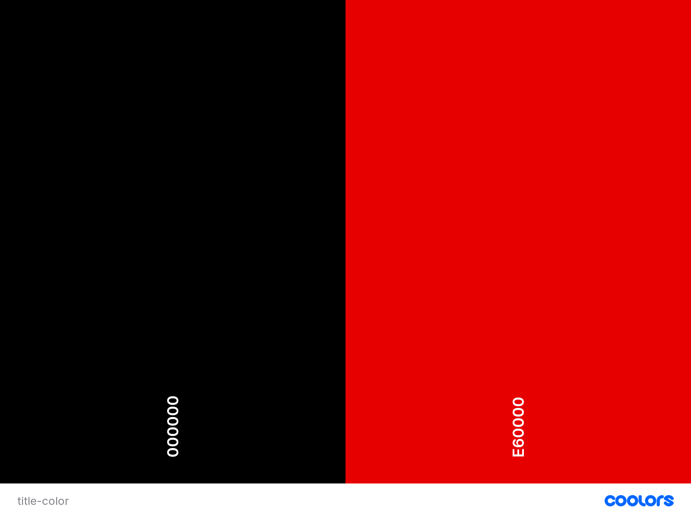

# F. Angel
* This website is for anybody that is interested in the recipes that are shown here or wants to ask me an experience chef any specific questions or recipes. All recipes and described in detailed way so beginner cooks can make them without previous experience.

## UX
-----------------
### User Stories
* The website will help people that are completely unexperienced in the kitchen to prepare simple to more complex recipes, with very clear and direct explanation of what needs to be one, also on how to clean or cut the ingredients for preparation of the dish. Also allowing the user to contact me for any questions on recipes that are not on the site, but also about any other kitchen related things.
* This website is also useful for advance chefs or people that are just looking for a recipe and have previous experience.
* Both groups of people I spoke to had the same complains about the websites that are out online at the moment. 
* There are too many commercials or pop ups every time you open one on your phone or on pc. 
* They write a big story about the recipe or where it came from and most of times is not clear when the actual recipe starts or what needs to be done, there is too much going around.
* Giving a clear view of where are the recipes and if the person is interested to learn about the chef there is an about me page.
---------
## Design
### Fonts
I chose to use [Castoro](https://fonts.google.com/specimen/Castoro?query=casto) for all my pages, only changing 2 main sentences on my [About Me](https://github.com/AngelEyeLife/Felipe-Recipes/blob/master/about-me.html) with the standard Sans-serif.
### Colours
I chose these colours for the Main title since it emphasizes heat or fire like in the kitchen: 

Choose this colour for the navbar since it make sit stand out from the background:

I like the titles to stand out more so is clear where you are on the page.

### Wireframes
* [Main wireframe for the Project](https://github.com/AngelEyeLife/Felipe-Recipes/blob/master/wireframe/angels-recipes-wireframe.pdf)
#### Changes to Wireframes
There were a lot of changes done to the wireframe in the process of making the website.

Header for all pages and background changes:

* The background change to a flame only, and to show only on the top with the title of the page and the navbar on the left side of the screen.
* Title has been made like is on fire and also an animation was added to the background so it looks like it’s a live.
* The navbar has been simplified to be only letter since I wanted to have more view on the background, and changing the colors to be easily seen on the background.
* There was a discussion over the navbar, to make is all vertical or horizontal. I choose the vertical since it looks good on all platforms, and like to have that space in the middle.
* The background is kept white for the rest of the page so the emphasis is on the food and recipes.
Footer changes:

* Decided to make only the social media side of the footer since is more of a personal site, and I want to share my ideas with everyone.
* Content has been centered on the bottom of the page.

Contact page:

* The content has been centered on the page so on big screens it will always be easy to see and not a big white open space on one side.

About me page:

* Decided to put a chef picture of my self as to show me in uniform to make it more inviting.
* The text has 2 sentences that have quotes and emphasis to make them stand out since those are the reason, I love cooking.

Recipe page:

* Diced to switch the list style recipe view to a simpler and with more impact on the user.
* There are images that show the final product, and a small but simple description with it summarizing the recipe.
* Decided to make it with modals: 
    * This have been made larger do is easier to read the whole recipe without having to scroll so much on a page.
    * There is again the final product picture on top of the modal.

---------
## Features
### Existing Features
1. In each page the user can see the title of the page and the 4 navigation options.
    1. In home page the user is able to see the best reviewed recipes.
    1. In about me page the user can learn about the creator of the site and the chef.
    1. The contact page is where the user can send questions or inquiries.
    1. the recipe page they can see a brief explanation of the recipe.
        1. From recipe page they open the recipe to see the details on how to make it by clicking on the button.

### Coming Features
1. Adding short videos or gifs to the recipes for the user to be able to see what the recipe is telling them to do.
---------------
## Technologies Used
1. [Bootstrap](https://getbootstrap.com/) Used their libraries and codes for components of my website.
1. [Freeimages](https://www.freeimages.com/) The background image I used came from this site.
1. [Code Institute](https://github.com/Code-Institute-Org/gitpod-full-template) Used the full template from CI with emmet that helped me a lot while codding.
1. [Start Bootstrap](https://startbootstrap.com/) Helped me place my background image.
------------
## Task Management
This list was made with the help of my mentor Narender, i wanted to make my last check list to make sure i covered all.

- []Change Navbar to one line. 
    * I decided to leave it as it is since I like the way it looks when it goes to smaller platforms, also leaving a nice space in the middle to see the flame moving.
- [x] Remove the background from all pages.
- [x] Stretch the modal.
- [x] Spell check emphasize text, central align.
- [x] Scenter contact page.
- [x] Check if font awesome works in the bottom of page.
- [x] Include section for colour and style of letter choice in README.md.
- [x] Include explanation of changes to the Wireframe and reasons why those changes happened.
- [x] Change the hovering colour to white and add line on the bottom.
------------
## Testing
### Contact page testing
    1. First name is not filled in it will not send form, will tell user to fill the field.
    1. Last name is not filled in it will not send form, will tell user to fill the field.
    1. Email is not filled in correctly it will not send form, will tell user to fill the field with an @ before and after.
    1. Text field needs to have something written to be sent correctly.
### Navigation bar
    1. Have tested that navigation from HOME to the other pages is working correctly, also reloading page works.
    1. Have tested that navigation from RECIPES to the other pages is working correctly, also reloading page works.
    1. Have tested that navigation from ABOUT ME to the other pages is working correctly, also reloading page works.
    1. Have tested that navigation from CONTACT to the other pages is working correctly, also reloading page works.
### Footer links
    1. All footers links are working from the HOME page.
    1. All footers links are working from the RECIPES page.
    1. All footers links are working from the ABOUT ME page.
    1. All footers links are working from the CONTACT page.
### Mobile view of the page
    1. All components of the website are reacting how they should in a mobile view.
### Validation of code
* While using [CSS Validation Services](https://jigsaw.w3.org/css-validator/) encountered 3 errors regarding value error for text-transform.
-------
## Deployment
### How to deploy to GitHub Pages
1. To deploy this page to GitHub Pages from it [GitHub repository](https://github.com/AngelEyeLife/Felipe-Recipes), the following steps were taken:
    1. Log into GitHub.
    1. From the list of repositories on the screen, select **AngelEyeLife/Felipe-Recipes**.
    1. From the menu items near the top of the page, select **Settings**.
    1. Scroll down the **GitHub Pages** section.
    1. Under **Source** click the drop-down menu labelled **None** and select **Master**.
    1. On selecting Master Branch the page is automatically refreshed, the website is now deployed.
    1. Scroll back down the **GitHub Pages** section to retrieve the link to the deployed website.

### How to run this project online
* To clone the project in to Gitpod you will need:
    1. A GitHub account. [Create your GitHub account](https://github.com/join?ref_cta=Sign+up&ref_loc=header+logged+out&ref_page=%2F&source=header-home)
    1. Use Chrome Browser, or open the [Gitpod page](https://gitpod.io/) directly.
* Then follow these steps:
    1. After creating a GitHub account navigate to the [Project repository](https://github.com/AngelEyeLife/Felipe-Recipes).
    1. You click the green **Gitpod** button.
    1. This will create a Gitpod workspace, where you can modify locally on the project.
------------
## Credits
### Content
* The row and Colum system used for all my project came from the contact website from CI [course.](https://courses.codeinstitute.net/courses/course-v1:codeinstitute+FE+2017_T3/courseware/616289d66b5641a3808cc43e53842695/f99dac3afcfe4b2caf8d576273aea3e6/?activate_block_id=block-v1%3Acodeinstitute%2BFE%2B2017_T3%2Btype%40sequential%2Bblock%40f99dac3afcfe4b2caf8d576273aea3e6)
* My footer I was able to place it where I want from Chris Coyier author of this [article.](https://css-tricks.com/couple-takes-sticky-footer/)
* The [title](https://codepen.io/nar3nd3r/pen/vYXBLmJ) is an original idea from Narender my mentor modified a little by me to fit page.
* All recipes have been made by me Felipe Angel.
* Background image animation was able to do it from [w3schools](https://www.w3schools.com/css/css3_animations.asp) and [@Igor Milenkovic](https://codepen.io/imilenig/pen/JxejbQ)
* [Quotes](https://www.w3schools.com/w3css/w3css_quotes.asp) came from the [w3schools](https://www.w3schools.com/default.asp).
* Used the [Am I responsive](http://ami.responsivedesign.is/#) website for head on [readme.md](README.md) page.
### Media
* The background photo I am using on all pages comes from [FreeImages.](https://www.freeimages.com/photo/flames-1-1174898)
* All other images are taken by me with Cell phone or a GoPro.
### Acknowledgements
* @Narender My mentor and helping me organize my ideas.
* @Laimo helped me with img code in HTML for my first img added on the index page.